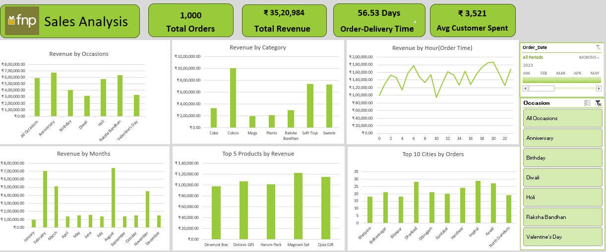

# FNP-Sales-Analysis-Dashboard
Interactive Excel Sales Dashboard built using Pivot Tables, Pivot Charts, Power Query, Power Pivot, Slicers, and Timeline.

## Project Overview

This project is an interactive Excel Sales Dashboard built to analyze sales performance for Ferns N Petals (FNP).

The dashboard provides insights into:

- Total Orders
- Total Revenue
- Average Order Delivery Time
- Average Customer Spending
- Revenue by Occasion
- Revenue by Category
- Revenue by Month
- Revenue by Hour (Order Time)
- Top 5 Products by Revenue
- Top 10 Cities by Orders


## Tools Used

- Microsoft Excel
- Pivot Tables
- Pivot Charts
- Power Query
- Power Pivot (Data Model)
- Slicers
- Timeline


## Dashboard Preview




## Dataset

The project uses the following datasets:

- customers.csv
- orders.csv
- products.csv


## Dashboard Features

- Interactive KPI Cards
- Dynamic Pivot Charts
- Timeline Filter
- Occasion Slicer
- Multi-table Data Model
- Clean and Interactive Dashboard


## Key Insights

- Colors generated the highest revenue among all product categories.
- Anniversary and Raksha Bandhan were among the highest revenue-generating occasions.
- Revenue trends varied across different months.
- Average customer spending was approximately ₹3,500.
- The dashboard supports interactive filtering using a Timeline and Occasion Slicer.


## Project Structure

```text
FNP-Sales-Analysis-Dashboard
│
├── Dashboard.xlsx
├── Dashboard.png
├── customers.csv
├── orders.csv
├── products.csv
└── README.md
```

---

## Author

**Prarthana Jadhav**

Aspiring Data Analyst

---

If you found this project helpful, feel free to give it a ⭐.
